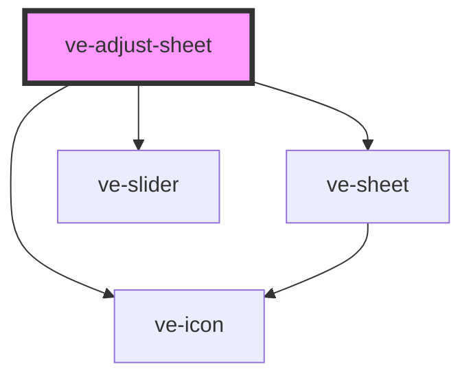

# ve-adjust-sheet

<!-- Auto Generated Below -->

## Overview

TikTok's Adjust sheet: one slider for the property being tuned, and a row of round property
buttons under it. Adjust is the whole video's colour, applied after the filter, so everything here
changes `manifest.adjust`.

Tap a property to tune it, double-tap it to put it back to 0; the head's "none" icon resets all
of them. A property that is not at 0 carries a dot, so a change made a while ago stays findable.

About eighty lines of the Angular sheet were gesture bookkeeping against `ion-range`, which moved
its value to the finger from the first touch and had to be argued out of it. `ve-slider` owns its
pointer, so the drag test, the knob restores and the start value kept to compare a release against
are all gone, and what is left is this sheet's own two questions: which property the slider is
pointed at, and the detent that ticks when one passes back through neutral.

## Properties

| Property           | Attribute | Description | Type            | Default     |
| ------------------ | --------- | ----------- | --------------- | ----------- |
| `ctx` _(required)_ | --        |             | `EditorContext` | `undefined` |

## Dependencies

### Depends on

- [ve-sheet](../ve-sheet)
- [ve-slider](../ve-slider)
- [ve-icon](../ve-icon)

### Graph

----------------------------------------------

*Built with [StencilJS](https://stenciljs.com/)*
