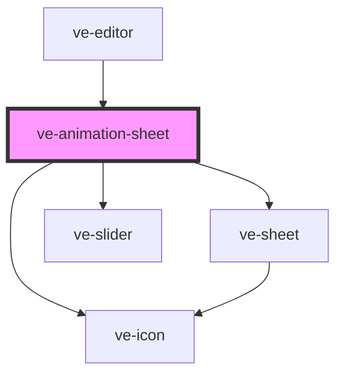

# ve-animation-sheet

<!-- Auto Generated Below -->

## Overview

The Animation tool: CapCut's In / Out / Loop picker for the selected layer. A row of tiles under the
frame's three tabs, None first, and under them how long the move takes - or, on Loop, how fast it
goes.

Every tile is the customer's OWN layer making that move - the text in its font, the sticker itself -
because a picker of labels asks them to imagine a slam on their caption, and this one shows it. The
moves are the render's: each tile compiles its preset with the render's compiler and reads it back
through the same `overlayMotionAt` the preview and the web engine read the export's keys with (see
`animation-tiles.ts`), so what a tile does is what the file will do. They loop, all of them, the
chosen one at the length the slider says.

Nothing here decides anything. A tile is `chooseAnimation`, None is `removeAnimation`, the slider is
`setAnimationMs`: the store plays the move on the frame - the layer arriving, leaving, or a few
cycles of its loop - and folds the whole visit into one undo step, as the transition sheet does,
because trying six entrances before settling on one is one decision.

The chosen tile is in its NAME (`Pop, selected`) and never in `aria-pressed`: on the Samsung A13's
WebView (Chrome 99) a change to `aria-pressed` inside a shadow root never reaches Android's
accessibility tree, while a change to the name does - the transition sheet's tiles and the zoom
sheet's chips made the same move. The slider sits between a visible word and a visible readout,
because a slider reaches Android's tree with no name of its own.

The tiles move outside the vdom, as the preview's layers do: a repaint is a diff of fourteen
buttons, and a move is two style writes per tile per frame, done by a `requestAnimationFrame` pump
straight onto the glyphs. No `IntersectionObserver`, which is where this differs from the
transition sheet: a tile here costs a transform on a composited image, not a GPU draw, and the few
scrolled out of sight cost less than watching them would.

## Properties

| Property           | Attribute | Description | Type            | Default     |
| ------------------ | --------- | ----------- | --------------- | ----------- |
| `ctx` _(required)_ | --        |             | `EditorContext` | `undefined` |

## Dependencies

### Used by

 - [ve-editor](../ve-editor)

### Depends on

- [ve-sheet](../ve-sheet)
- [ve-icon](../ve-icon)
- [ve-slider](../ve-slider)

### Graph

----------------------------------------------

*Built with [StencilJS](https://stenciljs.com/)*
