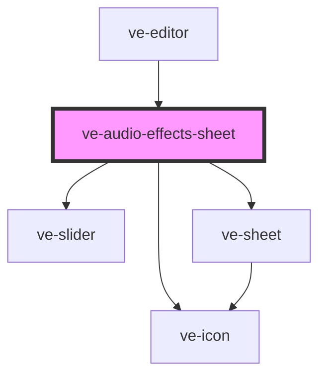

# ve-audio-effects-sheet

<!-- Auto Generated Below -->

## Overview

Effects for the selected sound: the head's "none" takes the effect off, as the Filters sheet's
does, a row of tiles under it puts one on - a megaphone, slow + reverb - and the sliders of the
one it has come under the tiles: how hard the megaphone is and its tone, how slow the song goes and
how big its room is. A tap is one undo step and so is a drag of a slider, and both apply at once;
the preview plays the sound through the effect as soon as `EditorMedia` has made the copy it plays
from, playing or not, so the customer hears the choice by pressing Play, which a compact sheet
leaves in reach. A slider let go has a new copy made, and the old one plays until it lands.

## Properties

| Property           | Attribute | Description | Type            | Default     |
| ------------------ | --------- | ----------- | --------------- | ----------- |
| `ctx` _(required)_ | --        |             | `EditorContext` | `undefined` |

## Dependencies

### Used by

 - [ve-editor](../ve-editor)

### Depends on

- [ve-slider](../ve-slider)
- [ve-sheet](../ve-sheet)
- [ve-icon](../ve-icon)

### Graph

----------------------------------------------

*Built with [StencilJS](https://stenciljs.com/)*
