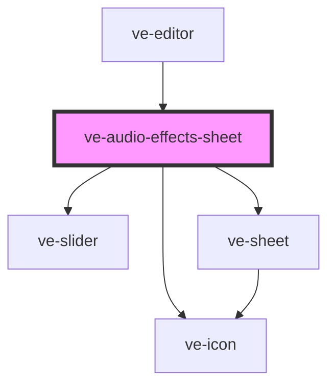

# ve-audio-effects-sheet

<!-- Auto Generated Below -->

## Overview

The effects for an audio effect layer: a row of tiles - a megaphone, slow + reverb, a male and a
female voice, a telephone - and under it the sliders of the one the selected layer has: how hard
the megaphone is and its tone, how slow the layer plays what it covers and how big its room is, how
far a voice is moved, how narrow the line is. With no layer selected, a tile adds one at the
playhead, on top of any already there ([EditorStore.chooseAudioEffect]); with one, a tile changes its
effect, and the head's "none" takes the layer away, as the Filters sheet's takes a filter off. A tap
is one undo step and so is a drag of a slider. The preview plays every sound the layer covers through
it as soon as `EditorMedia` has made the copy it plays from, so the customer hears the choice by
pressing Play, which a compact sheet leaves in reach; a slider let go has a new copy made, and the
old one plays until it lands.

## Properties

| Property           | Attribute | Description | Type            | Default     |
| ------------------ | --------- | ----------- | --------------- | ----------- |
| `ctx` _(required)_ | --        |             | `EditorContext` | `undefined` |

## Dependencies

### Used by

 - [ve-editor](../ve-editor)

### Depends on

- [ve-slider](../ve-slider)
- [ve-sheet](../ve-sheet)
- [ve-icon](../ve-icon)

### Graph

----------------------------------------------

*Built with [StencilJS](https://stenciljs.com/)*
