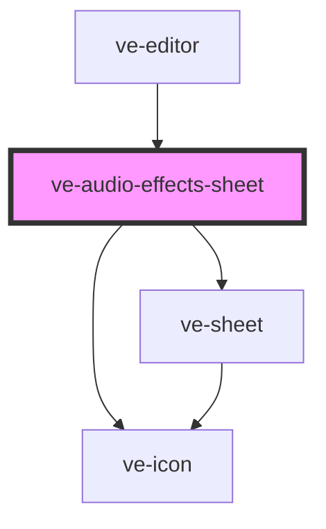

# ve-audio-effects-sheet

<!-- Auto Generated Below -->

## Overview

Effects for the selected sound: the head's "none" takes the effect off, as the Filters sheet's
does, and a row of tiles under it puts one on - a megaphone today. Each tap is one undo step and
applies at once; the preview plays the sound through it as soon as `EditorMedia` has made the copy
it plays from, playing or not, so the customer hears the choice by pressing Play, which a compact
sheet leaves in reach.

## Properties

| Property           | Attribute | Description | Type            | Default     |
| ------------------ | --------- | ----------- | --------------- | ----------- |
| `ctx` _(required)_ | --        |             | `EditorContext` | `undefined` |

## Dependencies

### Used by

 - [ve-editor](../ve-editor)

### Depends on

- [ve-sheet](../ve-sheet)
- [ve-icon](../ve-icon)

### Graph

----------------------------------------------

*Built with [StencilJS](https://stenciljs.com/)*
