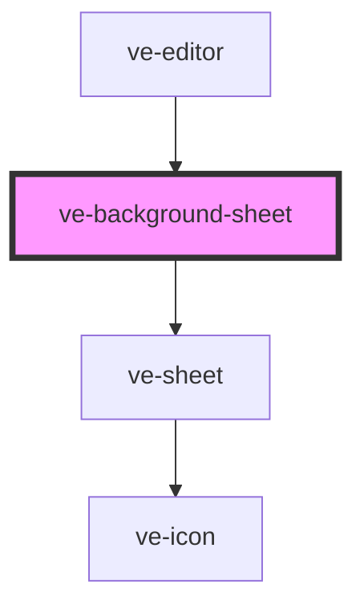

# ve-background-sheet

<!-- Auto Generated Below -->

## Overview

The colour of the canvas: what shows wherever no video is drawn - around a video made smaller than
the frame, in letterbox bars, past the end of the base track. It is what turns two videos placed
with room around them into a screenshot-style post.

A row of swatches and nothing to place: every tap goes straight to the store as one undo step, and
the preview above shows the canvas changing. Black is the first swatch, and choosing it is how the
colour is taken off again.

The chosen swatch is in its NAME (`White, selected`) and never in `aria-pressed`: on the Samsung
A13's WebView (Chrome 99) a change to `aria-pressed` inside a shadow root never reaches Android's
accessibility tree, while a change to the name does - the animation sheet made the same move.

## Properties

| Property           | Attribute | Description | Type            | Default     |
| ------------------ | --------- | ----------- | --------------- | ----------- |
| `ctx` _(required)_ | --        |             | `EditorContext` | `undefined` |

## Dependencies

### Used by

 - [ve-editor](../ve-editor)

### Depends on

- [ve-sheet](../ve-sheet)

### Graph

----------------------------------------------

*Built with [StencilJS](https://stenciljs.com/)*
