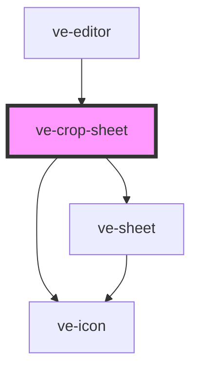

# ve-crop-sheet

<!-- Auto Generated Below -->

## Overview

TikTok's Crop sheet: a row of ratios, and the picture itself moved and pinched on the preview
above - which is where a crop is actually done. The sheet holds only the decisions a finger
cannot make for itself.

A ratio is a shape for the FINISHED picture, not for the part of the source that is kept: "1:1"
on a landscape video is a tall, narrow slice of it, and on a portrait one it is a short, wide
one. The arithmetic for that lives in [cropForAspect], next to the rest of the framing maths the
preview and the render agree on, so this component only ever hands a rectangle to the store.

Every tap here is one undo step. The pan and the pinch are one step per gesture, recorded by
`OverlayGestures` - the same rule that has always held for a layer being dragged.

What the Angular component kept in five computeds are five locals in `render`. Two signals stand
behind all of them, the render reads both, and `SignalWatcher` installs a fresh effect over
exactly what the last paint read: a value nothing but the render asks for has nothing to gain
from being remembered between paints.

## Properties

| Property           | Attribute | Description | Type            | Default     |
| ------------------ | --------- | ----------- | --------------- | ----------- |
| `ctx` _(required)_ | --        |             | `EditorContext` | `undefined` |

## Dependencies

### Used by

 - [ve-editor](../ve-editor)

### Depends on

- [ve-sheet](../ve-sheet)
- [ve-icon](../ve-icon)

### Graph

----------------------------------------------

*Built with [StencilJS](https://stenciljs.com/)*
