# ve-editor


<!-- Auto Generated Below -->


## Overview

The video editor, laid out the way TikTok's is, because that is the editor our customers already
know how to use: the video on top, a transport row, a timeline with a fixed centre playhead and
one lane per layer, and a row of tools at the bottom that turns into the tools for whatever is
selected.

This is the only tag a host application places by hand. It is handed the sources, a previous edit
if there is one, and everything it cannot do for itself as `host`; it hands back a
[VideoEditorResult] on `veDone` and a reason on `veCancel`, and it changes nothing the host owns
in between. Every other tag in this package is something this one renders.

```html
<ve-editor></ve-editor>
<script type="module">
  const editor = document.querySelector('ve-editor');
  editor.sources = clips;
  editor.host = { media, render, platform };
  editor.addEventListener('veDone', (event) => post(event.detail));
</script>
```

Everything the customer does is a change to an [EditManifest], held by the [EditorStore] this
element creates; nothing touches a file until they tap Next. The preview plays the ORIGINAL
sources with the filter in CSS and every layer drawn as the same bitmap the render will place,
and the finished video comes from the host's renderer reading the same manifest.

This element is only the frame: it loads the sources, lays the parts out, owns which panel is
open, and owns leaving - back, discard, and the render on Next. The parts do the editing.

## Properties

| Property               | Attribute     | Description                                                                                                                                                                                                                                                                                                                                              | Type                           | Default     |
| ---------------------- | ------------- | -------------------------------------------------------------------------------------------------------------------------------------------------------------------------------------------------------------------------------------------------------------------------------------------------------------------------------------------------------- | ------------------------------ | ----------- |
| `host`                 | --            | Everything the editor cannot do for itself: the pickers, the duration probe, the filmstrip, the renderer, the keyboard, haptics, the back button and the inset measurement. Every field of it is optional and what is missing falls back to a real browser implementation, so an editor with no host at all still edits and still hands back a manifest. | `VideoEditorHost \| undefined` | `undefined` |
| `manifest`             | --            | A previous edit of these sources, when the customer is stepping back into it.                                                                                                                                                                                                                                                                            | `EditManifest \| undefined`    | `undefined` |
| `maxSources`           | `max-sources` | How many sources may end up on the post, which is what "add" asks before offering itself. The public word is sources; inside, the store says clips for the same thing.                                                                                                                                                                                   | `number`                       | `10`        |
| `sources` _(required)_ | --            | The clips to edit, as the step before left them. The editor never opens one; it reads the key, the playable URL and the poster, hands the same objects back in the result, and leaves whatever else a host carries on them untouched.                                                                                                                    | `readonly EditorSource[]`      | `undefined` |


## Events

| Event      | Description                                                                                                                                                                                                                                                          | Type                             |
| ---------- | -------------------------------------------------------------------------------------------------------------------------------------------------------------------------------------------------------------------------------------------------------------------- | -------------------------------- |
| `veCancel` | The customer left without a video. `back` is what the editor itself emits, because its only way out is peeling back through what is open until there is nothing left to close; a host that takes the editor away for its own reasons is the other half of the union. | `CustomEvent<"back" \| "exit">`  |
| `veDone`   | The finished edit: the sources the post still uses, the manifest, and the rendered file when there was one to make. A single untouched clip is handed back unrendered rather than re-encoded.                                                                        | `CustomEvent<VideoEditorResult>` |


## CSS Custom Properties

| Name                 | Description                                                                                 |
| -------------------- | ------------------------------------------------------------------------------------------- |
| `--ve-accent`        | What marks the customer's own choice: a selected chip, a slider's fill, the render bar      |
| `--ve-bg`            | The page behind the whole editor, and the letterbox around the video                        |
| `--ve-chrome-max`    | How wide a row of chrome runs before it stops growing and centres itself                    |
| `--ve-cta`           | The one button that moves forward, Next                                                     |
| `--ve-cta-text`      | Text on that button, dark because the button is not                                         |
| `--ve-danger`        | Delete, and recording                                                                       |
| `--ve-dim`           | Secondary text: a caption, a total, an unselected tab                                       |
| `--ve-faint`         | Text and marks that are present but not being read: a disabled button, the timeline's ticks |
| `--ve-frame-edge`    | The hairline around the video frame, which is where the finished post is cut                |
| `--ve-lane-effect`   | The timeline lane colour for an effect layer                                                |
| `--ve-lane-image`    | The timeline lane colour for an image layer                                                 |
| `--ve-lane-ink`      | Text on a lane, dark because every lane colour is light                                     |
| `--ve-lane-music`    | The timeline lane colour for music                                                          |
| `--ve-lane-sticker`  | The timeline lane colour for a sticker layer                                                |
| `--ve-lane-text`     | The timeline lane colour for a text layer                                                   |
| `--ve-lane-voice`    | The timeline lane colour for a voiceover                                                    |
| `--ve-line`          | The hairline between two rows                                                               |
| `--ve-raised`        | A tile or a control sitting on a sheet                                                      |
| `--ve-raised-2`      | A tile sitting on another tile, one step further forward                                    |
| `--ve-safe-bottom`   | What the home indicator covers, replaced by a measurement once the host reports one         |
| `--ve-safe-top`      | What the status bar covers, replaced by a measurement once the host reports one             |
| `--ve-sheet`         | The background of an open sheet                                                             |
| `--ve-stage-gutter`  | What the preview keeps free either side of the video for Back and Next, together            |
| `--ve-surface`       | The toolbar's own background, a step up from the page                                       |
| `--ve-text`          | Text and glyphs at full strength                                                            |
| `--ve-toolbar-max`   | The same for the tool row, wide enough that its longest row still fits                      |
| `--ve-transport-max` | The same for the clock and transport row, which wants to stay tighter                       |


## Dependencies

### Depends on

- [ve-timeline](../ve-timeline)
- [ve-alert](../ve-alert)
- [ve-spinner](../ve-spinner)
- [ve-preview](../ve-preview)
- [ve-icon](../ve-icon)
- [ve-toast](../ve-toast)
- [ve-text-sheet](../ve-text-sheet)
- [ve-sticker-sheet](../ve-sticker-sheet)
- [ve-effects-sheet](../ve-effects-sheet)
- [ve-filter-sheet](../ve-filter-sheet)
- [ve-adjust-sheet](../ve-adjust-sheet)
- [ve-crop-sheet](../ve-crop-sheet)
- [ve-layout-sheet](../ve-layout-sheet)
- [ve-quality-sheet](../ve-quality-sheet)
- [ve-speed-sheet](../ve-speed-sheet)
- [ve-volume-sheet](../ve-volume-sheet)
- [ve-opacity-sheet](../ve-opacity-sheet)
- [ve-voiceover-sheet](../ve-voiceover-sheet)
- [ve-toolbar](../ve-toolbar)
- [ve-progress](../ve-progress)

### Graph

```mermaid
graph TD;
  ve-editor --> ve-timeline
  ve-editor --> ve-alert
  ve-editor --> ve-spinner
  ve-editor --> ve-preview
  ve-editor --> ve-icon
  ve-editor --> ve-toast
  ve-editor --> ve-text-sheet
  ve-editor --> ve-sticker-sheet
  ve-editor --> ve-effects-sheet
  ve-editor --> ve-filter-sheet
  ve-editor --> ve-adjust-sheet
  ve-editor --> ve-crop-sheet
  ve-editor --> ve-layout-sheet
  ve-editor --> ve-quality-sheet
  ve-editor --> ve-speed-sheet
  ve-editor --> ve-volume-sheet
  ve-editor --> ve-opacity-sheet
  ve-editor --> ve-voiceover-sheet
  ve-editor --> ve-toolbar
  ve-editor --> ve-progress
  ve-timeline --> ve-icon
  ve-preview --> ve-icon
  ve-text-sheet --> ve-sheet
  ve-text-sheet --> ve-icon
  ve-sheet --> ve-icon
  ve-sticker-sheet --> ve-sheet
  ve-sticker-sheet --> ve-icon
  ve-effects-sheet --> ve-sheet
  ve-filter-sheet --> ve-sheet
  ve-filter-sheet --> ve-slider
  ve-adjust-sheet --> ve-sheet
  ve-adjust-sheet --> ve-slider
  ve-adjust-sheet --> ve-icon
  ve-crop-sheet --> ve-sheet
  ve-crop-sheet --> ve-icon
  ve-layout-sheet --> ve-sheet
  ve-layout-sheet --> ve-slider
  ve-layout-sheet --> ve-icon
  ve-quality-sheet --> ve-sheet
  ve-speed-sheet --> ve-sheet
  ve-speed-sheet --> ve-slider
  ve-volume-sheet --> ve-sheet
  ve-volume-sheet --> ve-icon
  ve-volume-sheet --> ve-slider
  ve-opacity-sheet --> ve-sheet
  ve-opacity-sheet --> ve-slider
  ve-voiceover-sheet --> ve-sheet
  ve-toolbar --> ve-icon
  style ve-editor fill:#f9f,stroke:#333,stroke-width:4px
```


----------------------------------------------

*Built with [StencilJS](https://stenciljs.com/)*
