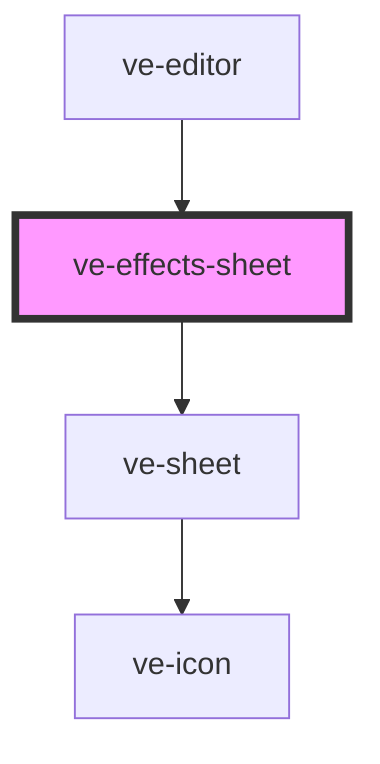

# ve-effects-sheet

<!-- Auto Generated Below -->

## Overview

The Effects tool: TikTok's compact effect picker - search, none, category tabs, and a grid of
previews - over a slim timeline, so the customer watches the effect land on their own video.

A tap with no effect layer selected adds one from the playhead to the end and selects it; a tap
while an effect layer is selected swaps that layer's effect. The sheet stays open either way, so
trying one look after another is a row of taps, each its own undo step.

Each preview is the customer's own frame under the playhead with the effect drawn over it by the
same `drawEffect` the rasteriser uses, so the thumbnail is an honest picture of the result.

The previews live outside the vdom on purpose. A repaint is a diff of forty buttons; a preview is
a decode and two `drawImage` calls, so they are drawn onto their canvases by a budgeted rAF pump
keyed by `effectId|frameUrl` and only the cells an `IntersectionObserver` says are on screen are
ever drawn at all.

## Properties

| Property           | Attribute | Description | Type            | Default     |
| ------------------ | --------- | ----------- | --------------- | ----------- |
| `ctx` _(required)_ | --        |             | `EditorContext` | `undefined` |

## Dependencies

### Used by

 - [ve-editor](../ve-editor)

### Depends on

- [ve-sheet](../ve-sheet)

### Graph

----------------------------------------------

*Built with [StencilJS](https://stenciljs.com/)*
