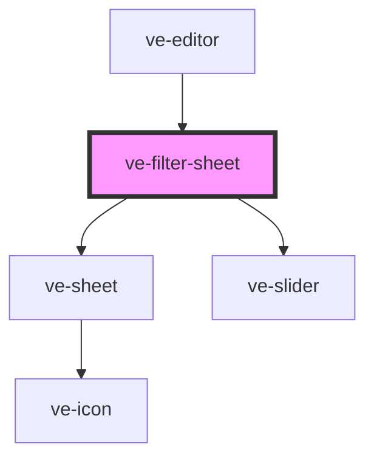

# ve-filter-sheet

<!-- Auto Generated Below -->

## Overview

TikTok's Filters sheet: the "none" icon and the categories in the frame's head, a strength slider
once a filter is on, and a row of thumbnails - the video's own frame under the playhead drawn
through each preset. A filter is the whole video's look, so this only ever changes `filterId` and
`filterIntensity`.

## Properties

| Property           | Attribute | Description | Type            | Default     |
| ------------------ | --------- | ----------- | --------------- | ----------- |
| `ctx` _(required)_ | --        |             | `EditorContext` | `undefined` |

## Dependencies

### Used by

 - [ve-editor](../ve-editor)

### Depends on

- [ve-sheet](../ve-sheet)
- [ve-slider](../ve-slider)

### Graph

----------------------------------------------

*Built with [StencilJS](https://stenciljs.com/)*
