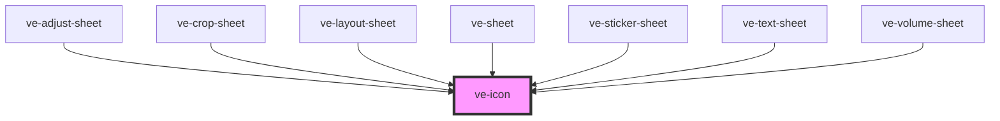

# ve-icon

<!-- Auto Generated Below -->

## Overview

One glyph, drawn from the shapes inlined in `src/icons`.

It is `ion-icon`'s shape without `ion-icon`: an element that takes its size from the font size it
inherits and its colour from the text around it, so a button styles its icon the way it styles
its label. The shape is kept because the editor is already written to it. Fifteen of its
stylesheets size an icon with `font-size` and no two of them agree on the number, from 34px on
the play button to 14px on a preview handle, so a `size` prop would mean rewriting every one of
them into a second vocabulary that only icons speak.

Every instance in the editor is decorative - the glyph sits inside a button that already carries
its name - so an icon is hidden from the accessibility tree unless it is given a `label`.

## Properties

| Property            | Attribute | Description                                                                                                                                                                                                                                | Type                                                                                                                                                                                                                                                                                                                                                                                                                                                                                                                                                                                                                                                                                                                                                                                                                                                                                                                                                                                                                                                                                                                                                                                                                                                       | Default     |
| ------------------- | --------- | ------------------------------------------------------------------------------------------------------------------------------------------------------------------------------------------------------------------------------------------ | ---------------------------------------------------------------------------------------------------------------------------------------------------------------------------------------------------------------------------------------------------------------------------------------------------------------------------------------------------------------------------------------------------------------------------------------------------------------------------------------------------------------------------------------------------------------------------------------------------------------------------------------------------------------------------------------------------------------------------------------------------------------------------------------------------------------------------------------------------------------------------------------------------------------------------------------------------------------------------------------------------------------------------------------------------------------------------------------------------------------------------------------------------------------------------------------------------------------------------------------------------------- | ----------- |
| `label`             | `label`   | What a screen reader announces. Left unset, the element is `aria-hidden`, which is what nearly every use of an icon in this editor wants: the name is already on the button, and an icon that announces itself reads every tile out twice. | `string \| undefined`                                                                                                                                                                                                                                                                                                                                                                                                                                                                                                                                                                                                                                                                                                                                                                                                                                                                                                                                                                                                                                                                                                                                                                                                                                      | `undefined` |
| `name` _(required)_ | `name`    | Which shape to draw. A name that is not in the map draws nothing, deliberately: `src/icons` has no fallback glyph, because a missing icon is a typo and an empty box is how it is noticed.                                                 | `"add" \| "arrow-down-circle-outline" \| "arrow-down-outline" \| "arrow-forward" \| "arrow-redo-outline" \| "arrow-undo-outline" \| "arrow-up-circle-outline" \| "arrow-up-outline" \| "ban-outline" \| "bookmark-outline" \| "chatbox-ellipses-outline" \| "checkmark" \| "chevron-back" \| "chevron-down" \| "close" \| "cloudy-outline" \| "color-fill-outline" \| "color-filter-outline" \| "color-palette-outline" \| "color-wand-outline" \| "contract-outline" \| "contrast-outline" \| "copy-outline" \| "create-outline" \| "crop-outline" \| "cut-outline" \| "duplicate-outline" \| "expand-outline" \| "grid-outline" \| "happy-outline" \| "link-outline" \| "mic" \| "mic-outline" \| "musical-note" \| "musical-note-outline" \| "musical-notes-outline" \| "options-outline" \| "pause" \| "pencil" \| "play" \| "play-skip-back-outline" \| "play-skip-forward-outline" \| "repeat-outline" \| "resize-outline" \| "scan-outline" \| "search-outline" \| "sparkles" \| "sparkles-outline" \| "speedometer-outline" \| "sunny-outline" \| "swap-horizontal-outline" \| "swap-vertical-outline" \| "text-outline" \| "thermometer-outline" \| "time-outline" \| "trash-outline" \| "volume-high" \| "volume-high-outline" \| "volume-mute"` | `undefined` |

## Dependencies

### Used by

 - [ve-adjust-sheet](../ve-adjust-sheet)
 - [ve-crop-sheet](../ve-crop-sheet)
 - [ve-layout-sheet](../ve-layout-sheet)
 - [ve-sheet](../ve-sheet)
 - [ve-sticker-sheet](../ve-sticker-sheet)
 - [ve-text-sheet](../ve-text-sheet)
 - [ve-volume-sheet](../ve-volume-sheet)

### Graph

----------------------------------------------

*Built with [StencilJS](https://stenciljs.com/)*
