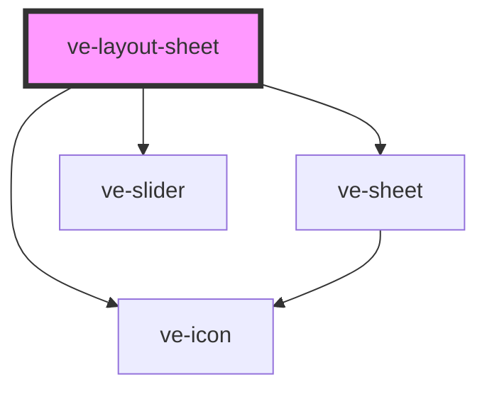

# ve-layout-sheet

<!-- Auto Generated Below -->

## Overview

Where the two videos sit on the frame: split screen, a corner inset, or one over the other.

A layout is nothing but a pair of rectangles written onto the clips of the two layers - the same
`rect` the crop tool already writes, and the same one the native engines already draw - so there
is no geometry here at all. The presets hold it, this row shows it, and every tap goes straight
to the store as one undo step with the preview above showing the result.

## Properties

| Property           | Attribute | Description | Type            | Default     |
| ------------------ | --------- | ----------- | --------------- | ----------- |
| `ctx` _(required)_ | --        |             | `EditorContext` | `undefined` |

## Dependencies

### Depends on

- [ve-sheet](../ve-sheet)
- [ve-slider](../ve-slider)
- [ve-icon](../ve-icon)

### Graph

----------------------------------------------

*Built with [StencilJS](https://stenciljs.com/)*
