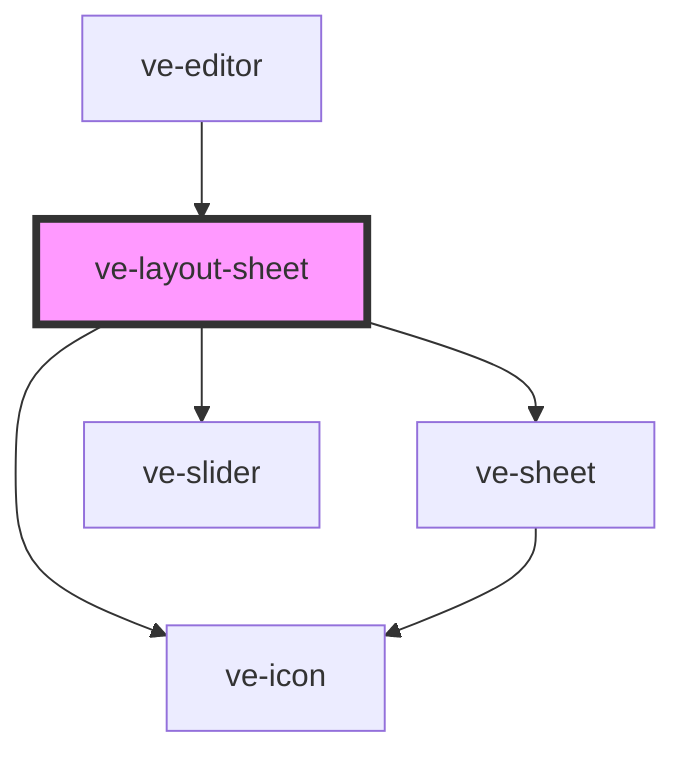

# ve-layout-sheet

<!-- Auto Generated Below -->

## Overview

Where the two videos sit on the frame: split screen, a corner inset, or one over the other - and,
on its second tab, how that arrangement opens when the second video comes on and closes when it
goes.

A layout is nothing but a pair of rectangles written onto the clips of the two layers - the same
`rect` the crop tool already writes, and the same one the native engines already draw - so there
is no geometry here at all. The presets hold it, this row shows it, and every tap goes straight
to the store as one undo step with the preview above showing the result.

An animation is one choice and one length, and nothing to place: the arrangement it opens into is
the one on the Layout tab, and when it opens is where the second video sits on the timeline. Each
tile draws its move on the customer's own arrangement, and choosing one plays it on the frame.

## Properties

| Property           | Attribute | Description | Type            | Default     |
| ------------------ | --------- | ----------- | --------------- | ----------- |
| `ctx` _(required)_ | --        |             | `EditorContext` | `undefined` |

## Dependencies

### Used by

 - [ve-editor](../ve-editor)

### Depends on

- [ve-sheet](../ve-sheet)
- [ve-icon](../ve-icon)
- [ve-slider](../ve-slider)

### Graph

```mermaid
graph TD;
  ve-layout-sheet --> ve-sheet
  ve-layout-sheet --> ve-icon
  ve-layout-sheet --> ve-slider
  ve-sheet --> ve-icon
  ve-editor --> ve-layout-sheet
  style ve-layout-sheet fill:#f9f,stroke:#333,stroke-width:4px
```

----------------------------------------------

*Built with [StencilJS](https://stenciljs.com/)*
