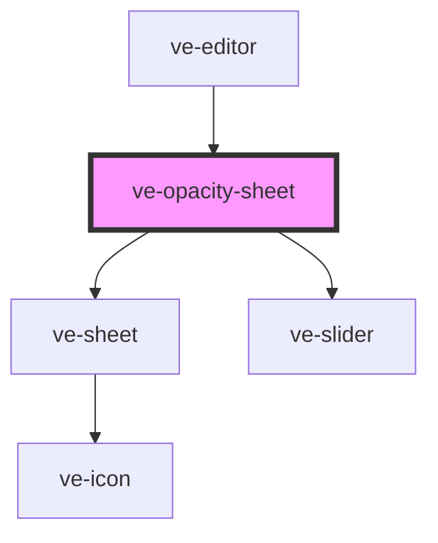

# ve-opacity-sheet

<!-- Auto Generated Below -->

## Overview

Opacity of the selected layer - or, for an effect layer, its strength, which the manifest keeps in
the same field. There is no swatch: the preview above already shows the layer changing.

The name is worked out once and handed over twice, to the frame as its heading and to the slider
as its label, because the slider's label is what the undo step is called: a customer who dragged
a vignette's strength should be offered "Undo Strength" and not "Undo Opacity".

## Properties

| Property           | Attribute | Description | Type            | Default     |
| ------------------ | --------- | ----------- | --------------- | ----------- |
| `ctx` _(required)_ | --        |             | `EditorContext` | `undefined` |

## Dependencies

### Used by

 - [ve-editor](../ve-editor)

### Depends on

- [ve-sheet](../ve-sheet)
- [ve-slider](../ve-slider)

### Graph

----------------------------------------------

*Built with [StencilJS](https://stenciljs.com/)*
