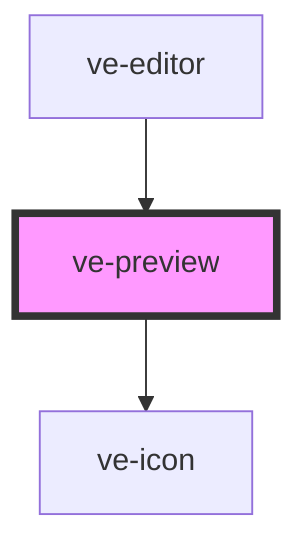

# ve-preview

<!-- Auto Generated Below -->

## Overview

The video at the top of the editor: the edit played back live, every layer drawn over it as the
bitmap the render will place, and the layers moved, scaled and turned by hand right on the frame.

Nothing here is a rendering of its own. The video is the ORIGINAL clips on one `<video>` element
per video track with the filter as CSS, and each layer is the PNG `OverlayBitmaps` rasterised for
it - so where a layer sits here, at the size it shows, is where the finished video has it.

Two elements at the most, and the second one is only written out while the post has a second
track: a phone decodes two video streams at once and the feed behind this editor may already hold
one, which is the whole reason [MAX_VIDEO_TRACKS] is two.

It is also the editor's player: the store forwards every play, pause and seek here. `seek`, `play`
and `pause` are therefore plain methods and not `@Method()`s, because a `@Method()` has to return
a promise and the store's [EditorPlayer] is synchronous - the store is this component's public
API, and the element carries nothing but `ctx`.

Scoped rather than shadow, which is the one exception in the package. `chromeBounds` measures the
host's own box through `stage.parentElement` to work out how far into the letterbox band a
selection handle may hang, and inside a shadow root that parent is null: the fallback clamps every
handle to the frame, with no error and nothing failing, and the two regressions `HANDLE_EDGE_PX`
exists to prevent are back. Scoped also keeps both `<video>` elements in the light DOM, which is
where WKWebView composites them today.

## Properties

| Property           | Attribute | Description | Type            | Default     |
| ------------------ | --------- | ----------- | --------------- | ----------- |
| `ctx` _(required)_ | --        |             | `EditorContext` | `undefined` |

## Dependencies

### Used by

 - [ve-editor](../ve-editor)

### Depends on

- [ve-icon](../ve-icon)

### Graph

----------------------------------------------

*Built with [StencilJS](https://stenciljs.com/)*
