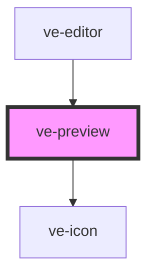

# ve-preview

<!-- Auto Generated Below -->

## Overview

The video at the top of the editor: the edit played back live, every layer drawn over it as the
bitmap the render will place, and the layers moved, scaled and turned by hand right on the frame.

The picture is ONE CANVAS, composited by `Painter` - the browser renderer's own compositor - from
one hidden `<video>` element per video track, and two for the base track, which take turns so
that a cut is never a load and a transition has both of its clips. It is not a second
implementation of the render contract that agrees with the first by inspection: it is the first,
handed the same layers, so where a clip sits here, at the size, angle and colour it shows, is
where the finished video has it. See [PreviewCanvas]. Each overlay layer is still the PNG
`OverlayBitmaps` rasterised for it, drawn over the canvas as an ``, because that is what the
render places too.

ONE ELEMENT PER TRACK, with no cap on how many. It was two - the base and the front-most layer -
because a phone decodes two video streams comfortably and the feed behind this editor may already
hold one. What that cost was worse than the decoders it saved: a post with three layers showed
the first and the third, and somebody who split a clip and pushed half of it onto a layer of its
own watched it vanish from the preview while the timeline went on showing it and the export went
on including it. An editor that draws most of the post is not a preview of anything.

So every layer is drawn, and the cost is a hardware decoder each. A customer who stacks more of
them than their phone can decode will see that happen; that is a post they built, and the honest
thing is to show it to them rather than to leave one out and say nothing.

It is also the editor's player: the store forwards every play, pause and seek here. `seek`, `play`
and `pause` are therefore plain methods and not `@Method()`s, because a `@Method()` has to return
a promise and the store's [EditorPlayer] is synchronous - the store is this component's public
API, and the element carries nothing but `ctx`.

Scoped rather than shadow, which is the one exception in the package. `chromeBounds` measures the
host's own box through `stage.parentElement` to work out how far into the letterbox band a
selection handle may hang, and inside a shadow root that parent is null: the fallback clamps every
handle to the frame, with no error and nothing failing, and the two regressions `HANDLE_EDGE_PX`
exists to prevent are back. Scoped also keeps every `<video>` element in the light DOM, which is
where WKWebView decodes them today.

## Properties

| Property           | Attribute | Description | Type            | Default     |
| ------------------ | --------- | ----------- | --------------- | ----------- |
| `ctx` _(required)_ | --        |             | `EditorContext` | `undefined` |

## Methods

### `picture() => Promise<HTMLCanvasElement | null>`

The picture on screen at this moment, for whoever wants a still of the post: the editor's
export screen shows one while the file is built.

The canvas itself, not a copy and not a data URL. A copy is the caller's to make at whatever
size it wants, and `toDataURL` throws on a canvas drawn from a clip on another origin - which
the example pages' clips are - while `drawImage` of the same canvas works everywhere. It is the
video layers, colour and framing included, and none of the text or stickers, which are drawn
over it in the DOM.

Null until the compositor exists, because before that the element is an empty rectangle.

#### Returns

Type: `Promise<HTMLCanvasElement | null>`

## Dependencies

### Used by

 - [ve-editor](../ve-editor)

### Depends on

- [ve-icon](../ve-icon)

### Graph

----------------------------------------------

*Built with [StencilJS](https://stenciljs.com/)*
