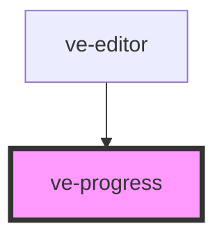

# ve-progress

<!-- Auto Generated Below -->

## Overview

The bar the editor shows while the native composer builds the video.

It is `ion-progress-bar`'s shape without Ionic, kept deliberately close to it so the render card
around it is a straight port: a `value` in 0..1 and a `type` that is either `determinate` or
`indeterminate`. The two colours it exposes are the same two Ionic exposed, renamed off Ionic's
generic `--background` and `--progress-background` so a host setting one of those on the editor
cannot reach in here by accident.

It holds no state and reads nothing from the store. The number belongs to whoever is running the
render: `EditorRenderHost.render` reports it, the shell writes it into a signal, and the shell
also decides which of the two states the bar is in, because that decision is about the render and
not about the bar. The editor's rule is `progress > 0 ? 'determinate' : 'indeterminate'`, so the
bar sweeps for as long as the encoder has said nothing at all.

There is no cancel and no phase here, because the composer has neither. Its `progress` event
carries `{ jobId, progress }` and nothing else: no stage, no step, no estimate. Cancelling is the
shell's `AbortController`, which reaches the render through the host rather than through a button
on the bar, and the overlay the bar sits in offers no way to stop a render today.

## Properties

| Property | Attribute | Description                                                                                                                                                                                                                                                                                                                                                                                                                                                                         | Type                               | Default         |
| -------- | --------- | ----------------------------------------------------------------------------------------------------------------------------------------------------------------------------------------------------------------------------------------------------------------------------------------------------------------------------------------------------------------------------------------------------------------------------------------------------------------------------------- | ---------------------------------- | --------------- |
| `label`  | `label`   | What a screen reader announces the bar as. A `progressbar` with no name is announced as a number with nothing attached to it, so the shell passes the sentence its own card is showing and the two are heard as one thing.                                                                                                                                                                                                                                                          | `string`                           | `'Progress'`    |
| `type`   | `type`    | Whether the number means anything yet. `indeterminate` sweeps a stripe instead of filling, for the part of a render that reports nothing: the spec is rasterised, the job is queued, and on iOS the export sits in `.pending` and `.waiting` states that carry no number at all.                                                                                                                                                                                                    | `"determinate" \| "indeterminate"` | `'determinate'` |
| `value`  | `value`   | How much is done, as a fraction of one.  Clamped, and a number that is not finite is read as nothing done, because these numbers cross the bridge from a native encoder and nothing between there and here checks them. Both engines already clamp to 0.99 and only ever emit on a one per cent step, but the clamp is what keeps a host's own arithmetic honest: `scaleX(NaN)` is an invalid declaration, which drops the whole transform and paints a bar that reads as finished. | `number`                           | `0`             |

## CSS Custom Properties

| Name                  | Description                                                               |
| --------------------- | ------------------------------------------------------------------------- |
| `--ve-progress-fill`  | The part that is, and the whole of the stripe while the amount is unknown |
| `--ve-progress-track` | The part of the bar that is not done yet                                  |

## Dependencies

### Used by

 - [ve-editor](../ve-editor)

### Graph

----------------------------------------------

*Built with [StencilJS](https://stenciljs.com/)*
