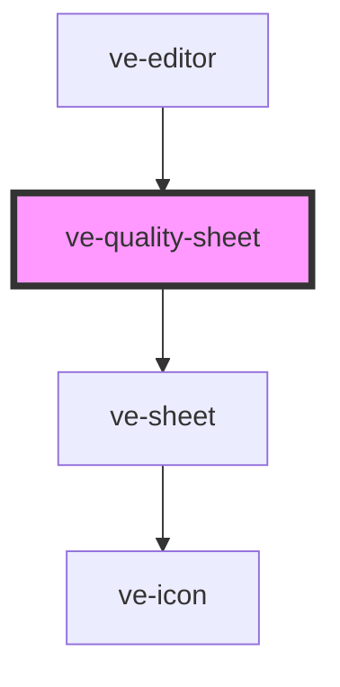

# ve-quality-sheet

<!-- Auto Generated Below -->

## Overview

The shape and the size of the finished post: how it stands, how many pixels it is, and how many
frames a second - with what that will come to on disk under all three.

Every rung is ASKED ABOUT before it is offered. A phone from four years ago has no 4K encoder and
a browser without WebCodecs has whatever its recorder will take, so a ladder that offered all of
them everywhere would be a promise this package cannot keep: the render fails at the end, after
the editing, which is the worst moment to find out. What comes back unsupported is greyed out
with the reason beside it, because a disabled chip with nothing to say reads as a broken app.

The size is an estimate in the honest sense - an encoder allowed to spend less on a still shot
does - and it is worth showing anyway: it is the difference between choosing 4K and understanding
what choosing 4K means.

A host with an upload limit (`EditorOutputOptions.maxBytes`) has every rung whose estimate is
over it marked with the limit, and the chosen one explained under the size. Marked and never
greyed: that same estimate is a rate the encoder may spend less than, a still or dark post often
comes in well under it, and the render measures the real file and says so if it does not fit. A
greyed rung would refuse a post that would have gone through; a marked one tells the customer
before the render rather than after it.

## Properties

| Property           | Attribute | Description | Type            | Default     |
| ------------------ | --------- | ----------- | --------------- | ----------- |
| `ctx` _(required)_ | --        |             | `EditorContext` | `undefined` |

## Dependencies

### Used by

 - [ve-editor](../ve-editor)

### Depends on

- [ve-sheet](../ve-sheet)

### Graph

----------------------------------------------

*Built with [StencilJS](https://stenciljs.com/)*
