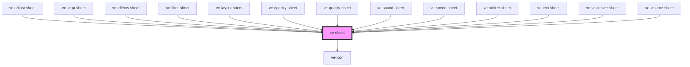

# ve-sheet

<!-- Auto Generated Below -->

## Overview

The frame every editor sheet sits in, so that all twelve read as one thing: TikTok's bottom sheet,
an optional search field, then a row of "none" / tabs / tick, then the sheet's own content.

It only draws the chrome. What "none", a tab or the tick mean is the host sheet's business, told
through the events.

It takes no `ctx`. Nothing here reads a signal or writes one, and a required prop that is never
read would cost all twelve sheets a line each to hand over a store this element has no question to
ask of. A sheet still takes its own `ctx`; it just does not pass it in here.

Three of its methods exist because the sheets inside it cannot reach into this shadow root:
`bodyElement` and `scrollBodyTo` for the two sheets whose content is one long scroller, and
`blurSearch` for the one that has to drop the keyboard before it closes.

## Properties

| Property            | Attribute            | Description                                                                                                                                                                                                                                                                                                                                                                                           | Type                  | Default  |
| ------------------- | -------------------- | ----------------------------------------------------------------------------------------------------------------------------------------------------------------------------------------------------------------------------------------------------------------------------------------------------------------------------------------------------------------------------------------------------- | --------------------- | -------- |
| `activeTab`         | `active-tab`         | Which tab is underlined, by `id`. Null underlines none, which is how a search result list reads.                                                                                                                                                                                                                                                                                                      | `null \| string`      | `null`   |
| `heading`           | `heading`            | The sheet's name, at the left of the head.  Not `title`, which is what the Angular component called it: an element with a `title` attribute grows a browser tooltip, and the generated `HTMLVeSheetElement` would be redeclaring `HTMLElement.title` with a type that does not match it.                                                                                                              | `null \| string`      | `null`   |
| `noneLabel`         | `none-label`         | What a screen reader calls the "none" button. Two sheets clear a setting rather than remove a thing, and "None" tells a screen reader nothing about what will happen on those.  This is a prop because the Angular sheets could not make it one: they waited a frame and rewrote the rendered button's attribute by hand, through a `querySelector` that now returns null from outside a shadow root. | `string`              | `'None'` |
| `searchPlaceholder` | `search-placeholder` | Shows the search row when set, with this as the field's placeholder.                                                                                                                                                                                                                                                                                                                                  | `null \| string`      | `null`   |
| `searchValue`       | `search-value`       | What is in the search field. The sheet owns the text and hands it back, so it can clear it.                                                                                                                                                                                                                                                                                                           | `string`              | `''`     |
| `showConfirm`       | `show-confirm`       | Shows the tick that closes the sheet. Only the text sheet, which has nothing to confirm, hides it.                                                                                                                                                                                                                                                                                                    | `boolean`             | `true`   |
| `showNone`          | `show-none`          | Shows the "none" button, which the sheet answers by clearing whatever it applies.                                                                                                                                                                                                                                                                                                                     | `boolean`             | `false`  |
| `tabs`              | --                   | The tabs across the head, left to right. No tabs is the usual case and draws no strip.                                                                                                                                                                                                                                                                                                                | `readonly SheetTab[]` | `[]`     |

## Events

| Event       | Description                                                | Type                  |
| ----------- | ---------------------------------------------------------- | --------------------- |
| `veConfirm` | The tick was pressed.                                      | `CustomEvent<void>`   |
| `veNone`    | The "none" button was pressed.                             | `CustomEvent<void>`   |
| `veSearch`  | The search text changed, carrying the field's whole value. | `CustomEvent<string>` |
| `veTab`     | A tab was pressed, carrying its `id`.                      | `CustomEvent<string>` |

## Methods

### `blurSearch() => Promise<void>`

Takes the focus off the search field, which is what closes the keyboard before a sheet
disappears from under it.

The sheets used to blur whatever `document.activeElement` named. From outside a shadow root that
is the outermost host rather than the field, and blurring a host in the focus chain does drop
the keyboard - along with the focus on everything else in the editor. The field is in here, so
the question is answered in here.

#### Returns

Type: `Promise<void>`

### `bodyElement() => Promise<HTMLElement | null>`

The element that scrolls, for a sheet that has to measure inside it: the sticker sheet's section
jumps and both sheets' `IntersectionObserver` roots are questions about this box, and it is in a
shadow root the sheet cannot query.

Null until the first render. A Stencil method call waits for the component's instance, not for
its first paint, and in the custom elements build it does not wait at all, so a caller reaching
for this from its own `componentWillLoad` gets nothing. Both sheets that use it already treat a
missing scroller as "not yet", which is the same answer.

#### Returns

Type: `Promise<HTMLElement | null>`

### `scrollBodyTo(top: number, behavior?: ScrollBehavior) => Promise<void>`

Scrolls the body, and keeps in one place the feature test both callers would otherwise repeat.

`scrollTo` and never `scrollIntoView`: the latter scrolls every scrollable ancestor as well,
including the `overflow: hidden` ones, which drags the whole editor column off its layout.

#### Parameters

| Name       | Type                              | Description |
| ---------- | --------------------------------- | ----------- |
| `top`      | `number`                          |             |
| `behavior` | `"auto" \| "instant" \| "smooth"` |             |

#### Returns

Type: `Promise<void>`

## Slots

| Slot | Description      |
| ---- | ---------------- |
|      | The default slot |

## Dependencies

### Used by

 - [ve-adjust-sheet](../ve-adjust-sheet)
 - [ve-crop-sheet](../ve-crop-sheet)
 - [ve-effects-sheet](../ve-effects-sheet)
 - [ve-filter-sheet](../ve-filter-sheet)
 - [ve-layout-sheet](../ve-layout-sheet)
 - [ve-opacity-sheet](../ve-opacity-sheet)
 - [ve-quality-sheet](../ve-quality-sheet)
 - [ve-sound-sheet](../ve-sound-sheet)
 - [ve-speed-sheet](../ve-speed-sheet)
 - [ve-sticker-sheet](../ve-sticker-sheet)
 - [ve-text-sheet](../ve-text-sheet)
 - [ve-voiceover-sheet](../ve-voiceover-sheet)
 - [ve-volume-sheet](../ve-volume-sheet)

### Depends on

- [ve-icon](../ve-icon)

### Graph

----------------------------------------------

*Built with [StencilJS](https://stenciljs.com/)*
