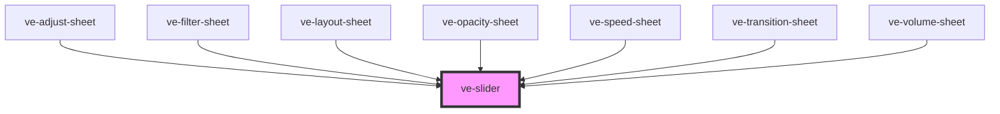

# ve-slider

<!-- Auto Generated Below -->

## Overview

The editor's slider: a thin grey bar, a white fill, a white knob and the value floating above it,
wired to the store so that a whole drag is exactly ONE undo step.

It is written from pointer events rather than built on a range input or a component library,
which is a change of mechanism and not of behaviour. The Angular editor drove `ion-range`, and
three of its sheets carried about eighty lines each of gesture code whose only job was to undo
what Ionic had already decided: Ionic moves its value to wherever the finger is from the very
first touch, so a finger put down a few pixels off the knob's centre changed the value before it
had moved at all, and every sheet had to notice that, throw the value away and put the knob back
on the next microtask. Owning the pointer means the knob is picked up by the offset it was
grabbed at and simply travels with the finger, and all of that goes away.

What it promises, which is what six sheets are written against:

 - The knob's position is a pure function of the `value` prop. A sheet maps slider units to its
   own value, writes them to the store, and the store repaints this element; nothing here keeps a
   value of its own to fall out of step with the manifest.
 - `veGestureStart` fires before the first `veLive`, and the store's gesture is already open when
   it does. The volume sheet needs that order: it is where it remembers the level to bring a
   track dragged to silence back to.
 - A press that never moves changes nothing and records no undo step.
 - A press on the bar beyond the knob's own radius jumps to the finger and lands as one step.
 - A drag that ends back where it started records nothing, which is `endGesture`'s own rule.
 - Being unmounted mid drag closes the gesture. Undo can take away the very layer the sheet is
   adjusting while a finger is still down, and a gesture left open would be inherited by whatever
   the customer did next.

## Properties

| Property             | Attribute     | Description                                                                                                                                                                                                                                                                                                                                                                                                                                                                                                                                                                                                                                              | Type                            | Default         |
| -------------------- | ------------- | -------------------------------------------------------------------------------------------------------------------------------------------------------------------------------------------------------------------------------------------------------------------------------------------------------------------------------------------------------------------------------------------------------------------------------------------------------------------------------------------------------------------------------------------------------------------------------------------------------------------------------------------------------- | ------------------------------- | --------------- |
| `ctx` _(required)_   | --            |                                                                                                                                                                                                                                                                                                                                                                                                                                                                                                                                                                                                                                                          | `EditorContext`                 | `undefined`     |
| `disabled`           | `disabled`    | Shown and out of reach: no focus, no press, no keys, and `aria-disabled` to say so. For a slider a sheet shows before it can be used - the transition sheet's duration on a plain cut, there to say a length can be set once there is a transition to set it on.  A prop, because the one attribute that decides focus is one this element renders on its own host. A `tabindex="-1"` a sheet put on it lasted exactly one render: Stencil keeps an attribute the parent set before the first one, then writes the host's own `0` over it on the next - the next time the value or the range moved - and the slider was back in the tab order by itself. | `boolean`                       | `false`         |
| `format`             | --            | The text above the knob, given the value.                                                                                                                                                                                                                                                                                                                                                                                                                                                                                                                                                                                                                | `(value: number) => string`     | `defaultFormat` |
| `from`               | `from`        | Where the fill runs from, for a scale that has a neutral point rather than a bottom end. The Adjust sheet's five two sided properties pass 0, so the bar fills out from the middle in the direction the property was taken. Unset, the fill starts at `min`.                                                                                                                                                                                                                                                                                                                                                                                             | `number \| undefined`           | `undefined`     |
| `label` _(required)_ | `label`       | The undo step's name, and the slider's accessible name.                                                                                                                                                                                                                                                                                                                                                                                                                                                                                                                                                                                                  | `string`                        | `undefined`     |
| `max`                | `max`         |                                                                                                                                                                                                                                                                                                                                                                                                                                                                                                                                                                                                                                                          | `number`                        | `100`           |
| `min`                | `min`         |                                                                                                                                                                                                                                                                                                                                                                                                                                                                                                                                                                                                                                                          | `number`                        | `0`             |
| `pin`                | `pin`         | Whether that text is shown. `press` is for a sheet that already shows the value large somewhere else and only wants it next to the finger; `none` is for a sheet with a readout in the same row, where two numbers chased each other across the row while the knob moved.                                                                                                                                                                                                                                                                                                                                                                                | `"always" \| "none" \| "press"` | `'always'`      |
| `snap`               | --            | Slider values the knob sticks to when it comes within `snapRadius` of them.                                                                                                                                                                                                                                                                                                                                                                                                                                                                                                                                                                              | `readonly number[]`             | `[]`            |
| `snapRadius`         | `snap-radius` |                                                                                                                                                                                                                                                                                                                                                                                                                                                                                                                                                                                                                                                          | `number`                        | `0`             |
| `step`               | `step`        |                                                                                                                                                                                                                                                                                                                                                                                                                                                                                                                                                                                                                                                          | `number`                        | `1`             |
| `value` _(required)_ | `value`       | In slider units.                                                                                                                                                                                                                                                                                                                                                                                                                                                                                                                                                                                                                                         | `number`                        | `undefined`     |

## Events

| Event            | Description                                                                    | Type                  |
| ---------------- | ------------------------------------------------------------------------------ | --------------------- |
| `veGestureStart` | A drag, or a press on the bar, has begun; the store's gesture is already open. | `CustomEvent<void>`   |
| `veLive`         | A live value inside that gesture, in slider units, snapped.                    | `CustomEvent<number>` |

## CSS Custom Properties

| Name                | Description                                                                                                    |
| ------------------- | -------------------------------------------------------------------------------------------------------------- |
| `--ve-slider-edge`  | How far the bar's ends sit inside the element, keeping the knob and the value above it inside a sheet's gutter |
| `--ve-slider-fill`  | The travelled part of the bar, and what a sheet changes to theme the control                                   |
| `--ve-slider-knob`  | The knob                                                                                                       |
| `--ve-slider-track` | The bar behind the fill                                                                                        |

## Dependencies

### Used by

 - [ve-adjust-sheet](../ve-adjust-sheet)
 - [ve-filter-sheet](../ve-filter-sheet)
 - [ve-layout-sheet](../ve-layout-sheet)
 - [ve-opacity-sheet](../ve-opacity-sheet)
 - [ve-speed-sheet](../ve-speed-sheet)
 - [ve-transition-sheet](../ve-transition-sheet)
 - [ve-volume-sheet](../ve-volume-sheet)

### Graph

----------------------------------------------

*Built with [StencilJS](https://stenciljs.com/)*
