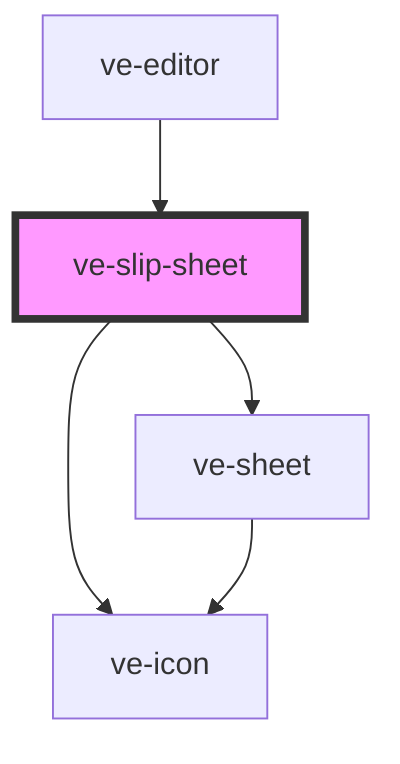

# ve-slip-sheet

<!-- Auto Generated Below -->

## Overview

Trim: which part of its clip the selected segment plays, at the length it already has.

Somebody who cut a ten second video down to three seconds and then wants a different three seconds
should not have to drag both trim handles and land them on the same length again. Here the length
is kept for them: the whole clip is a strip under a frame fixed in the middle, the frame is exactly
as long as the segment, and sliding the strip changes only which part of the clip is under it - a
slip, in an editor's words. Nothing else on the timeline moves.

The strip is a plain scrolling element, so a finger gets the phone's own fling and stop for free;
a mouse drags it and a wheel turns it, which no scrolling element does by itself; and a keyboard or
a screen reader moves the same part through a range hidden over it. Every slide is live: the
preview stays on the segment's first frame and follows the strip, the timeline's tiles move under
the segment, and the slide is one undo step when the strip comes to rest.

## Properties

| Property           | Attribute | Description | Type            | Default     |
| ------------------ | --------- | ----------- | --------------- | ----------- |
| `ctx` _(required)_ | --        |             | `EditorContext` | `undefined` |

## Dependencies

### Used by

 - [ve-editor](../ve-editor)

### Depends on

- [ve-sheet](../ve-sheet)
- [ve-icon](../ve-icon)

### Graph

----------------------------------------------

*Built with [StencilJS](https://stenciljs.com/)*
