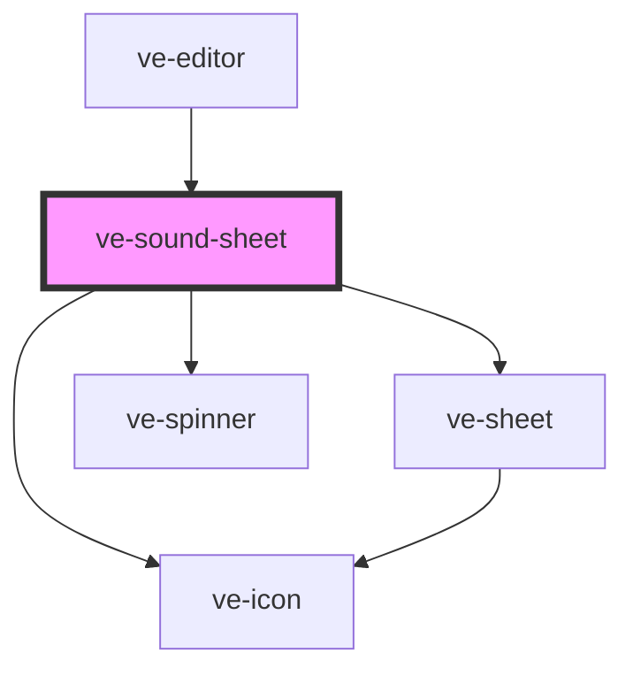

# ve-sound-sheet

<!-- Auto Generated Below -->

## Overview

The Sound sheet: where a track comes from.

Two ways in and a list of what came in before. "Extract from video" is the one this sheet exists
for - pick any video, the sound is pulled out of it, kept, and put on the post - and because it is
kept, the same sound is one tap away in every edit after this one. "From files" is the picker the
Sound menu used to open directly, unchanged.

Tapping a saved sound uses it and closes the sheet, which is the same gesture the sticker sheet
has: the sound lands on the timeline and the customer's eyes are already going there.

The library itself belongs to the host - see [EditorSoundLibrary] - and this sheet only ever asks
it three things. A host with no library never opens this sheet at all: `media.openSound()` sends
it straight to the file picker instead, because a sheet whose only content is one button is worse
than the button.

The preview player is this element's own. It is an `<audio>` rather than anything the editor's
preview owns, because what is being listened to here is not on the post yet and must not be mixed
into it - and the video is paused while it plays, so the two are never heard at once.

## Properties

| Property           | Attribute | Description | Type            | Default     |
| ------------------ | --------- | ----------- | --------------- | ----------- |
| `ctx` _(required)_ | --        |             | `EditorContext` | `undefined` |

## Dependencies

### Used by

 - [ve-editor](../ve-editor)

### Depends on

- [ve-icon](../ve-icon)
- [ve-sheet](../ve-sheet)
- [ve-spinner](../ve-spinner)

### Graph

----------------------------------------------

*Built with [StencilJS](https://stenciljs.com/)*
