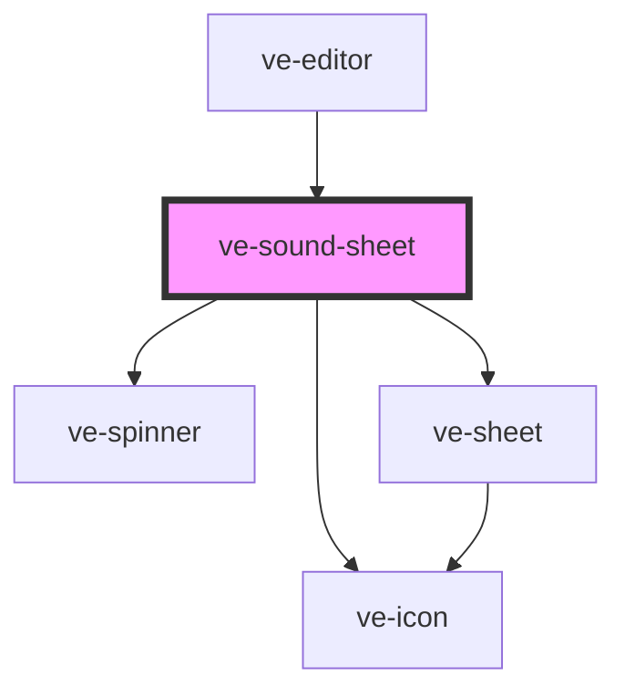

# ve-sound-sheet

<!-- Auto Generated Below -->

## Overview

The Sound sheet: where a track comes from.

Two ways in and a list of what came in before. "Extract from video" is the one this sheet exists
for - pick any video, the sound is pulled out of it, kept, and put on the post - and because it is
kept, the same sound is one tap away in every edit after this one. "From files" is the picker the
Sound menu used to open directly, unchanged.

A host with a music library ([EditorSoundCatalogue]) adds a tab per category beside them, the
customer's own sounds first as Saved. A catalogue row is a track on the host's server, so choosing
one waits for the host to fetch it, with a spinner on its row; listening to one before choosing
plays the host's `previewUrl` and fetches nothing.

Tapping a saved sound or a track uses it and closes the sheet, which is the same gesture the
sticker sheet has: the sound lands on the timeline and the customer's eyes are already going
there. A host whose library can hand a sound to the person ([EditorSoundLibrary.download]) gets a
download button on every saved row as well, which leaves the post and the sheet as they were.

It is the one sheet with a grabber. It opens at the height every tall sheet has, and dragging its
head up pulls it to most of the screen, for a long list of tracks; dragging it down closes it. The
shell owns the heights (`SheetDragger`); this sheet only turns the grabber on.

The library and the catalogue belong to the host, and this sheet only ever asks them for what it
shows. A host with neither never opens this sheet at all: `media.openSound()` sends it straight to
the file picker instead, because a sheet whose only content is one button is worse than the button.

The preview player is this element's own. It is an `<audio>` rather than anything the editor's
preview owns, because what is being listened to here is not on the post yet and must not be mixed
into it - and the video is paused while it plays, so the two are never heard at once.

## Properties

| Property           | Attribute | Description | Type            | Default     |
| ------------------ | --------- | ----------- | --------------- | ----------- |
| `ctx` _(required)_ | --        |             | `EditorContext` | `undefined` |

## Dependencies

### Used by

 - [ve-editor](../ve-editor)

### Depends on

- [ve-icon](../ve-icon)
- [ve-spinner](../ve-spinner)
- [ve-sheet](../ve-sheet)

### Graph

```mermaid
graph TD;
  ve-sound-sheet --> ve-icon
  ve-sound-sheet --> ve-spinner
  ve-sound-sheet --> ve-sheet
  ve-sheet --> ve-icon
  ve-editor --> ve-sound-sheet
  style ve-sound-sheet fill:#f9f,stroke:#333,stroke-width:4px
```

----------------------------------------------

*Built with [StencilJS](https://stenciljs.com/)*
