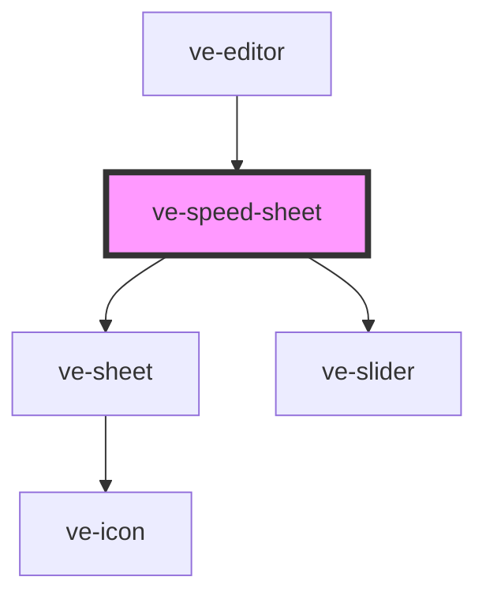

# ve-speed-sheet

<!-- Auto Generated Below -->

## Overview

Speed for the selected clip segment: a readout, TikTok's preset chips, a fine slider that snaps to
1x, and - with more than one segment - the offer to give them all the same speed. Every change
stretches the timeline, so the timeline above follows it live.

## Properties

| Property           | Attribute | Description | Type            | Default     |
| ------------------ | --------- | ----------- | --------------- | ----------- |
| `ctx` _(required)_ | --        |             | `EditorContext` | `undefined` |

## Dependencies

### Used by

 - [ve-editor](../ve-editor)

### Depends on

- [ve-sheet](../ve-sheet)
- [ve-slider](../ve-slider)

### Graph

----------------------------------------------

*Built with [StencilJS](https://stenciljs.com/)*
