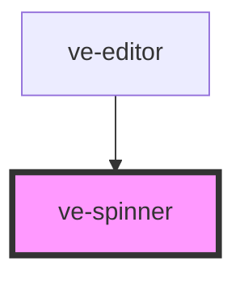

# ve-spinner

<!-- Auto Generated Below -->

## Overview

The editor's busy indicator: one rotating arc, the crescent the editor already shows while a
project loads.

It is drawn from a border rather than an SVG or a sprite so that it costs nothing to load and
inherits its colour from whatever it sits in. Size, weight, colour and speed are all CSS custom
properties, because the spinner appears at three different sizes across the editor and a prop
per size would put layout decisions inside the component.

## Properties

| Property | Attribute | Description                                                                                                                                                                           | Type     | Default     |
| -------- | --------- | ------------------------------------------------------------------------------------------------------------------------------------------------------------------------------------- | -------- | ----------- |
| `label`  | `label`   | What a screen reader announces while the arc is turning. It is a label rather than a slot because the arc has no text in it: without this the element is announced as nothing at all. | `string` | `'Loading'` |

## CSS Custom Properties

| Name                     | Description                                                                     |
| ------------------------ | ------------------------------------------------------------------------------- |
| `--ve-spinner-color`     | Colour of the lit part of the arc, defaulting to the inherited text colour      |
| `--ve-spinner-duration`  | Time for one full turn                                                          |
| `--ve-spinner-size`      | Diameter of the arc, including its stroke                                       |
| `--ve-spinner-thickness` | Width of the stroke                                                             |
| `--ve-spinner-track`     | Colour of the unlit part, transparent by default so the arc reads as a crescent |

## Dependencies

### Used by

 - [ve-editor](../ve-editor)

### Graph

----------------------------------------------

*Built with [StencilJS](https://stenciljs.com/)*
