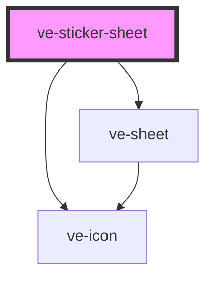

# ve-sticker-sheet

<!-- Auto Generated Below -->

## Overview

The Stickers tool: TikTok's nearly full-height picker - search, Stickers | Emoji tabs, a scrolling
grid split into sections, and a bar of category icons along the bottom that both follows the
scroll and jumps to a section when tapped.

A tap adds the sticker from the playhead to the end and closes the sheet, which leaves the new
layer selected on the video - exactly where the customer's eyes go next to move and size it.

The scrolling element belongs to the frame and is inside its shadow root, so this component asks
`ve-sheet` for it once rather than walking up the tree looking for a box that scrolls.

## Properties

| Property           | Attribute | Description | Type            | Default     |
| ------------------ | --------- | ----------- | --------------- | ----------- |
| `ctx` _(required)_ | --        |             | `EditorContext` | `undefined` |

## Dependencies

### Depends on

- [ve-sheet](../ve-sheet)
- [ve-icon](../ve-icon)

### Graph

----------------------------------------------

*Built with [StencilJS](https://stenciljs.com/)*
