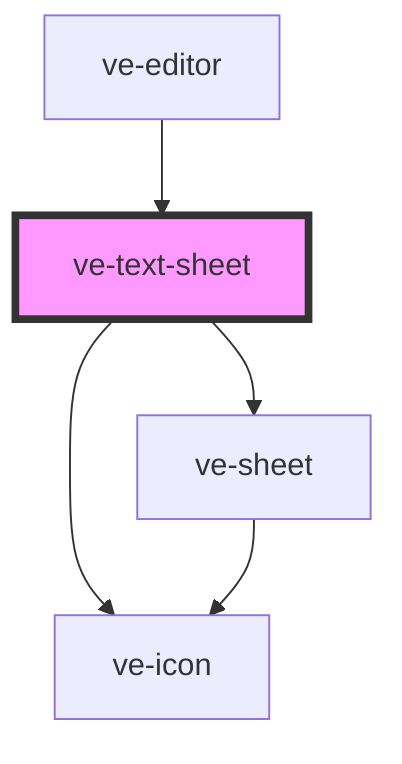

# ve-text-sheet

<!-- Auto Generated Below -->

## Overview

TikTok's "Add text" sheet: a text field between a cross and a tick, a row of five style icons,
and - when one of them is tapped - a panel that takes the keyboard's place (fonts, colours,
background, stroke).

The layer already exists when this opens: `store.startNewText()` / `startEditText()` created or
picked it and opened ONE gesture around the whole edit. So everything here - every keystroke,
every font, colour or alignment tap - is a live `previewOverlay`, and the preview redraws the
layer as it changes. The tick calls `finishText()`, which lands the gesture as a single undo step
(or drops an empty text); the cross before the field and the shell's back both call
`cancelText()`, which puts everything back. This sheet never commits or ends the gesture itself,
and never on destroy.

It draws its own head rather than the frame's: the cross and the tick belong either side of the
field, and the tab strip belongs inside the panel. Both are the frame's own pieces all the same -
`showConfirm` is off so there is one tick rather than two, and the strip is `sheet-common.css`'s,
so it is the same strip the frame's head draws and not one that merely looks like it.

## Properties

| Property           | Attribute | Description | Type            | Default     |
| ------------------ | --------- | ----------- | --------------- | ----------- |
| `ctx` _(required)_ | --        |             | `EditorContext` | `undefined` |

## Dependencies

### Used by

 - [ve-editor](../ve-editor)

### Depends on

- [ve-sheet](../ve-sheet)
- [ve-icon](../ve-icon)

### Graph

----------------------------------------------

*Built with [StencilJS](https://stenciljs.com/)*
