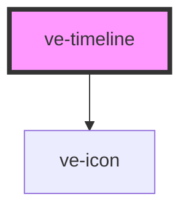

# ve-timeline

<!-- Auto Generated Below -->

## Overview

TikTok's timeline: a ruler, the video track as a filmstrip, and a lane under it for every layer,
the sound and the voiceover - all on one horizontal native scroller that moves under a WHITE
playhead fixed at the centre. Scrolling IS seeking.

Two directions of truth meet here, and keeping them from feeding each other is most of this file:
 - the customer's finger (and the fling after it) moves the scroller, which seeks the store;
 - everything else - playback, undo, a split, a sheet - moves the store's playhead, which scrolls
   the scroller.
A scroll only seeks while the customer's own scroll is live (from touchstart until the fling has
settled); in every other state a scroll event is ours, and is only used to move the render window.

Gestures are handled by delegation on the scroller, with every frame coalesced into one
`requestAnimationFrame`. What a touch means is read from the `data-hit` of the element under it.
The browser keeps doing what it does best: the content is `touch-action: pan-x`, so a horizontal
swipe anywhere is a native, compositor-driven scroll with momentum, while a vertical one is
refused by the browser and handed to us as pointer events (Chrome decides the axis from the first
movement past the touch slop and zeroes the other axis for the whole gesture) - which is how the
lanes scroll vertically under a fixed ruler and video track without the two directions ever
mixing. Handles and selected items are `touch-action: none`, so dragging them never scrolls
anything.

## Properties

| Property           | Attribute | Description                                                                                              | Type            | Default     |
| ------------------ | --------- | -------------------------------------------------------------------------------------------------------- | --------------- | ----------- |
| `compact`          | `compact` | The slim arrangement above a compact sheet: the filmstrip only (and the voiceover lane while recording). | `boolean`       | `false`     |
| `ctx` _(required)_ | --        |                                                                                                          | `EditorContext` | `undefined` |

## Dependencies

### Depends on

- [ve-icon](../ve-icon)

### Graph

----------------------------------------------

*Built with [StencilJS](https://stenciljs.com/)*
