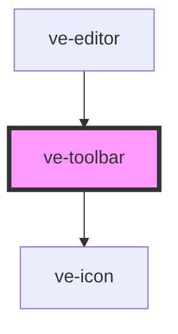

# ve-toolbar

<!-- Auto Generated Below -->

## Overview

TikTok's bottom tool row: dark rounded tiles that scroll sideways, and that turn into the tools for
whatever is selected - a clip, a layer, the music, a voiceover - with a chevron at the far left to
step back out.

The toolbar decides nothing itself. Every tile calls a store action (or the media layer for the
ones that open a picker), so a tool behaves the same here as from the timeline or the preview, and
every change it makes is a single undo step because the store's action is.

What the row shows is derived from a handful of small computed signals (the row kind, the layer's
place in the drawing order, whether music loops...) rather than from the selected objects
themselves. `SignalWatcher` subscribes the component to exactly what the last paint read, and a
drag on the preview replaces the selected layer's object on every frame: a render reading
`manifest.value` would therefore rebuild and repaint the whole row sixty times a second, on the
phone that needs those frames for the drag. A computed only wakes its readers when its own value
changes, so a boolean or a short string in front of the manifest is what keeps the row still.

## Properties

| Property           | Attribute | Description | Type            | Default     |
| ------------------ | --------- | ----------- | --------------- | ----------- |
| `ctx` _(required)_ | --        |             | `EditorContext` | `undefined` |

## Dependencies

### Used by

 - [ve-editor](../ve-editor)

### Depends on

- [ve-icon](../ve-icon)

### Graph

----------------------------------------------

*Built with [StencilJS](https://stenciljs.com/)*
