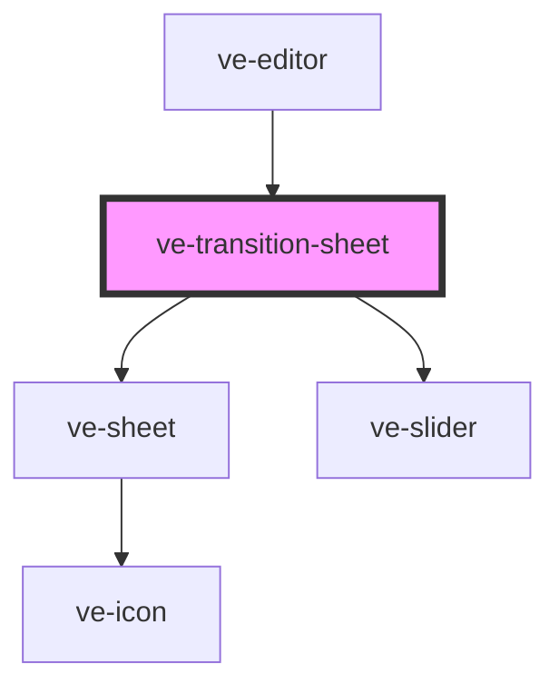

# ve-transition-sheet

<!-- Auto Generated Below -->

## Overview

LightCut's transition picker, opened by the white dot on a cut: Basic, Camera, Mask and Effect in
the frame's head, a row of tiles, how long the transition runs, and the offer to use it on every
cut of the video.

Every tile is the customer's OWN two clips going through that transition - the frame the outgoing
clip leaves on and the frame the incoming one opens with, drawn at the moment that says most about
it - and the chosen tile plays it on a loop. A picker of static icons asks the customer to imagine
a spin on their own footage; this one shows it to them.

Nothing here decides anything. A tile is `chooseTransition`, None is `removeTransition`, the
slider is `setTransitionDuration`: the store auditions the choice in the preview and folds the
whole visit into one undo step, so the sheet can be browsed freely and left with one tap of undo.

Every tile is drawn by the render's own painter, handed the very transition the export draws at
that moment, so what a tile shows is what the customer will get - blur, mosaic and all. The
thumbnails live outside the vdom, as the effects sheet's do: a repaint is a diff of nine buttons,
and a thumbnail is a GPU composite, so they are drawn onto their canvases by a budgeted
`requestAnimationFrame` pump, and only the tiles an `IntersectionObserver` says are on screen are
drawn at all.

## Properties

| Property           | Attribute | Description | Type            | Default     |
| ------------------ | --------- | ----------- | --------------- | ----------- |
| `ctx` _(required)_ | --        |             | `EditorContext` | `undefined` |

## Dependencies

### Used by

 - [ve-editor](../ve-editor)

### Depends on

- [ve-sheet](../ve-sheet)
- [ve-slider](../ve-slider)

### Graph

----------------------------------------------

*Built with [StencilJS](https://stenciljs.com/)*
