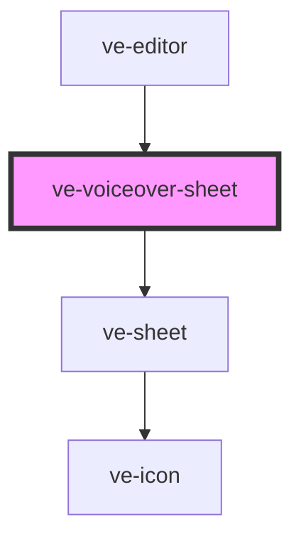

# ve-voiceover-sheet

<!-- Auto Generated Below -->

## Overview

TikTok's voiceover recorder: one big record button, the time it records from, and the takes made
so far. The preview, the transport and a compact timeline stay above it, and the timeline draws
the take growing in red while `store.recordingFromMs` is set.

A take runs against the video: recording starts playback from the playhead and ends by itself
when it reaches the next take or the end of the video, or when playback is stopped - so the voice
always lands exactly over the frames the customer was watching while they spoke.

The microphone belongs to this sheet. Closing it (the tick, or the shell's back button taking the
panel away) ends a take in progress and KEEPS it: losing a take to a tap on the tick would be far
worse than having one more to delete. The stop that ends it outlives the element, which is why
`ve-editor` renders this sheet at a fixed position in its own tree: an element the vdom moved is
disconnected and reconnected, and that would end a take the customer is still speaking into.

## Properties

| Property           | Attribute | Description | Type            | Default     |
| ------------------ | --------- | ----------- | --------------- | ----------- |
| `ctx` _(required)_ | --        |             | `EditorContext` | `undefined` |

## Dependencies

### Used by

 - [ve-editor](../ve-editor)

### Depends on

- [ve-sheet](../ve-sheet)

### Graph

----------------------------------------------

*Built with [StencilJS](https://stenciljs.com/)*
