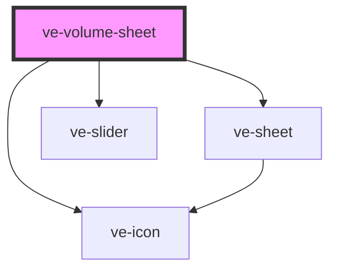

# ve-volume-sheet

<!-- Auto Generated Below -->

## Overview

Volume for whatever the store's `volumeTarget` names - a clip segment, the music or a voiceover
take - as a mute button beside a percentage slider.

The clips' own sound is not one of the targets: the voiceover sheet and the timeline's speaker
switch it in place, which is one tap instead of a sheet.

Three kinds of target, one sheet, and only a clip carries a `muted` flag of its own. That is the
whole of why `restoreVolume` exists: for the music and a take, muting IS setting the level to
zero, and nothing in the manifest remembers where it came from.

## Properties

| Property           | Attribute | Description | Type            | Default     |
| ------------------ | --------- | ----------- | --------------- | ----------- |
| `ctx` _(required)_ | --        |             | `EditorContext` | `undefined` |

## Dependencies

### Depends on

- [ve-sheet](../ve-sheet)
- [ve-icon](../ve-icon)
- [ve-slider](../ve-slider)

### Graph

----------------------------------------------

*Built with [StencilJS](https://stenciljs.com/)*
