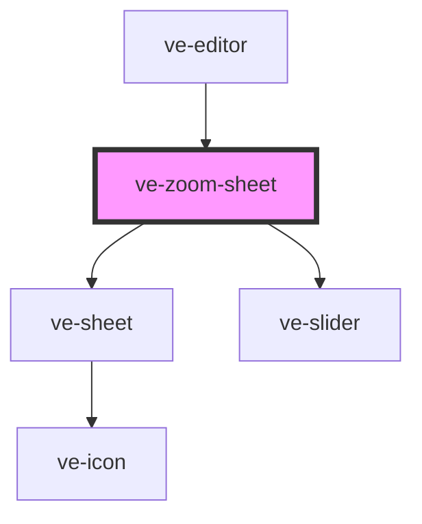

# ve-zoom-sheet

<!-- Auto Generated Below -->

## Overview

The selected zoom's settings: how far in it goes, how the camera moves, and how long the move
takes. WHERE it goes is not here - the area is picked on the picture itself, by dragging and
pinching the box the preview draws while this sheet is open and the video is paused - so the sheet
says that in one line rather than offering two sliders for a centre nobody can aim by number.

Compact on purpose, and short inside compact: three rows and the hint, well inside the 259px the
transition sheet is held to, so the picture the box is dragged on stays as large as it can be.

Every control writes the manifest live through `store.updateZoom`, as every other sheet does, and
the tick only closes the sheet: undo is the way back. Each slider drag passes a coalesce key of its
own, so a drag - which calls the store sixty times a second - lands as ONE undo step, and the next
drag is another. A curve tapped is a step of its own.

The chosen curve is in each tile's NAME (`Smooth, selected`) and never in `aria-pressed`: on the
Samsung A13's WebView (Chrome 99) a change to `aria-pressed` inside a shadow root never reaches
Android's accessibility tree, and a button with both a label and `aria-pressed` arrives there as a
ToggleButton with no text at all - nothing for TalkBack to read or for Maestro to find. The
transition sheet and the timeline's dots made the same move.

Each slider sits between a visible word and a visible readout, because a slider reaches Android's
tree with no name of its own; the word and the number are what TalkBack and Maestro have.

## Properties

| Property           | Attribute | Description | Type            | Default     |
| ------------------ | --------- | ----------- | --------------- | ----------- |
| `ctx` _(required)_ | --        |             | `EditorContext` | `undefined` |

## Dependencies

### Used by

 - [ve-editor](../ve-editor)

### Depends on

- [ve-sheet](../ve-sheet)
- [ve-slider](../ve-slider)

### Graph

----------------------------------------------

*Built with [StencilJS](https://stenciljs.com/)*
